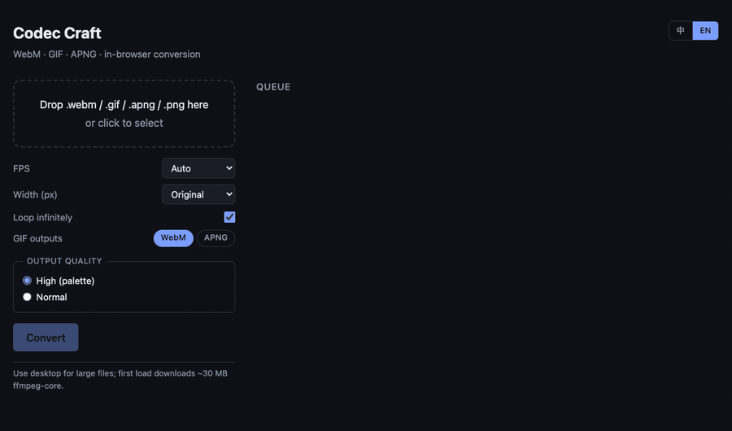

# Codec Craft

[](./LICENSE)
[](https://github.com/ffmpegwasm/ffmpeg.wasm)
[](https://github.com/howar31/codecraft/actions/workflows/deploy.yml)
[](https://www.conventionalcommits.org)
[](https://github.com/howar31/codecraft/stargazers)
[](https://github.com/howar31/codecraft/commits/main)
[](https://donate.howar31.com/)

> 名稱 **Codec Craft**，slug `codecraft`（中間兩個 c 合併）。

瀏覽器內 codec 工作台：WebM / GIF / APNG 兩兩互轉。檔案不離開裝置，全程在本地用 ffmpeg.wasm 處理。架構為「每個轉換一個 pill」，未來預留 trim / crop / mute 等非轉換型工具的擴充。

In-browser codec workbench for WebM / GIF / APNG cross-conversion. Files never leave your device — everything runs locally via ffmpeg.wasm. The UI is pill-per-conversion; future tools (trim / crop / mute) plug in as additional pills.



**線上版本 / Live:** https://lab.howar31.com/codecraft/

## Features

- 純前端，無後端，無上傳；30 MB 的 ffmpeg-core 在首次轉檔時才從 CDN 載入
- **PWA / 離線可用**：可加入桌面或主畫面；Service Worker 第一次連線時把 app shell 與 30 MB 的 ffmpeg-core 都快取下來，之後完全離線也能轉檔 / Installable PWA — after the first online visit, the service worker caches the app shell and the 30 MB ffmpeg-core so subsequent conversions work fully offline
- **6 條轉換路徑**：WebM ↔ GIF、GIF ↔ APNG、WebM ↔ APNG。每條轉換一個 pill，UI 只露出該轉換真正相關的選項
- 拖檔到錯誤 pill 時自動切到對的那個（記住每個 source 上次用的 pill），info toast 確認
- 設定快照（snapshot at drop）：拖入瞬間把 FPS / 寬度 / 品質 / Loop 拍存進該卡，後續改 sidebar 不會影響已排入的卡
- ✎ 編輯模式：sidebar 變身為該卡的編輯介面，整頁 dim 只剩編輯卡 + 控制面板亮著；確認後可「覆蓋本卡」或「建立新卡」；ESC 取消
- FPS 預設「依來源」可選 10 ~ 50；寬度預設「原寬」可選 240 ~ 1920
- 三種 target 各自的品質語意（每個 pill 標籤都對應實際 codec 行為）：
  - **→ GIF** — 精細取色（palettegen + paletteuse）vs 快速取色（ffmpeg 單段預設）
  - **→ WebM** — 畫質優先（VP8 CRF 10）vs 檔案優先（VP8 CRF 24）
  - **→ APNG** — 最小檔案（`-pred mixed -compression_level 9`）vs 快速編碼（PNG 預設）
- 無限循環設定只出現在 GIF / APNG 輸出（會寫進 Netscape Loop Extension / `acTL.num_plays`）；WebM 容器無此 metadata 所以該 pill 不顯示
- 完成後就地預覽 GIF / APNG（``）與 WebM（`<video>`），並提供下載連結
- 超過 5 MB 顯示警告（hover 看詳細）
- 重複檔案偵測（同名同大小提示但不阻擋）
- 拖檔可從整個瀏覽器視窗任何位置丟入；`.png` 會 byte-sniff `acTL` 判定是否為 APNG
- Viewport-fit 佈局：header / pills / footer 釘住，只有佇列區捲動；toast 出現在畫面正上方
- 設定按 pill 各自持久化（`codecraft.opts.<pill-id>`），上次用的 pill 也記住，URL hash 可直接 bookmark 特定轉換
- i18n（中文 / English）切換、偏好寫入 localStorage

## Stack

Vite + Vanilla JS + `@ffmpeg/ffmpeg` 0.12（single-threaded）

## Development

```bash
npm install
npm run dev        # http://localhost:5173/codecraft/
npm run build      # → dist/
npm run preview
```

## Deployment

push 到 `main` 即觸發 GitHub Actions（`.github/workflows/deploy.yml`），建置後發布到 `gh-pages` 分支。GitHub Pages 設定 source 為 `gh-pages` branch / root。

## Notes

- 首次載入 `ffmpeg-core` 約 30MB（從 unpkg CDN）。
- 使用 single-threaded 變體，不需要 COOP/COEP headers，可直接部署於 GitHub Pages。
- 大檔案建議在桌機處理；行動裝置記憶體較易吃緊。

## License

MIT
